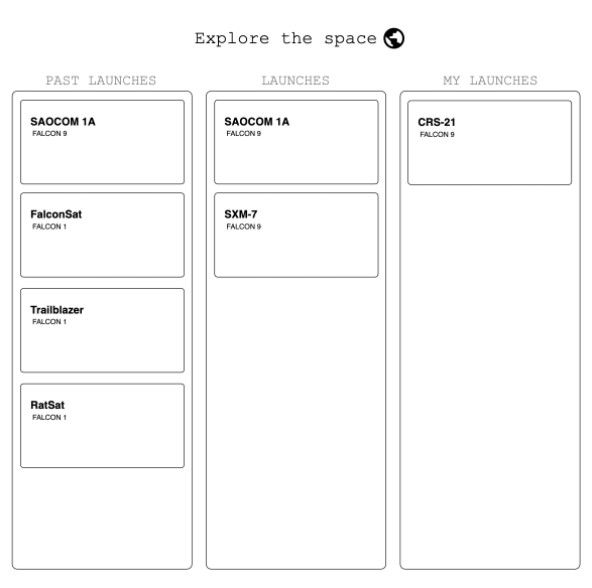

Приложение по бронированию космических полётов, используя `SpaceX Open API`.

### Функции интерфейса:
1. Просмотр списка предстоящих космических полётов.
2. Просмотр списка прошедших космических полетов.
3. Просмотр списка забронированных космических полётов.
4. Бронирование космического полёта.
5. Отмена бронирования космического полёта.
6. Детальный просмотр информации о полёте.

###Запуск проекта:
1. yarn
2. yarn dev

###Описание:
В качестве API используется https://github.com/r-spacex/SpaceX-API/tree/master/docs  

Так как запросы, меняющие состояние сервера данное API не предоставляет, запросы на бронирование и отмену брони, - замоканы.

Пример интерфейса:

